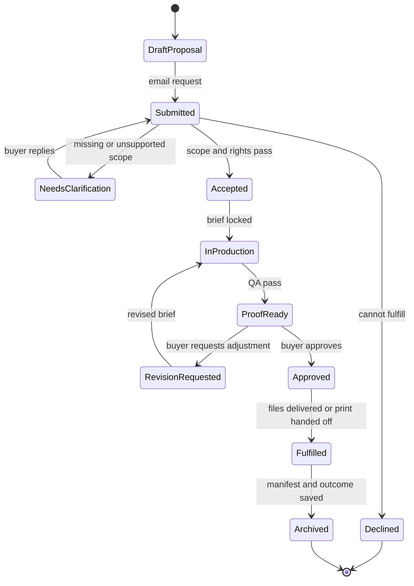
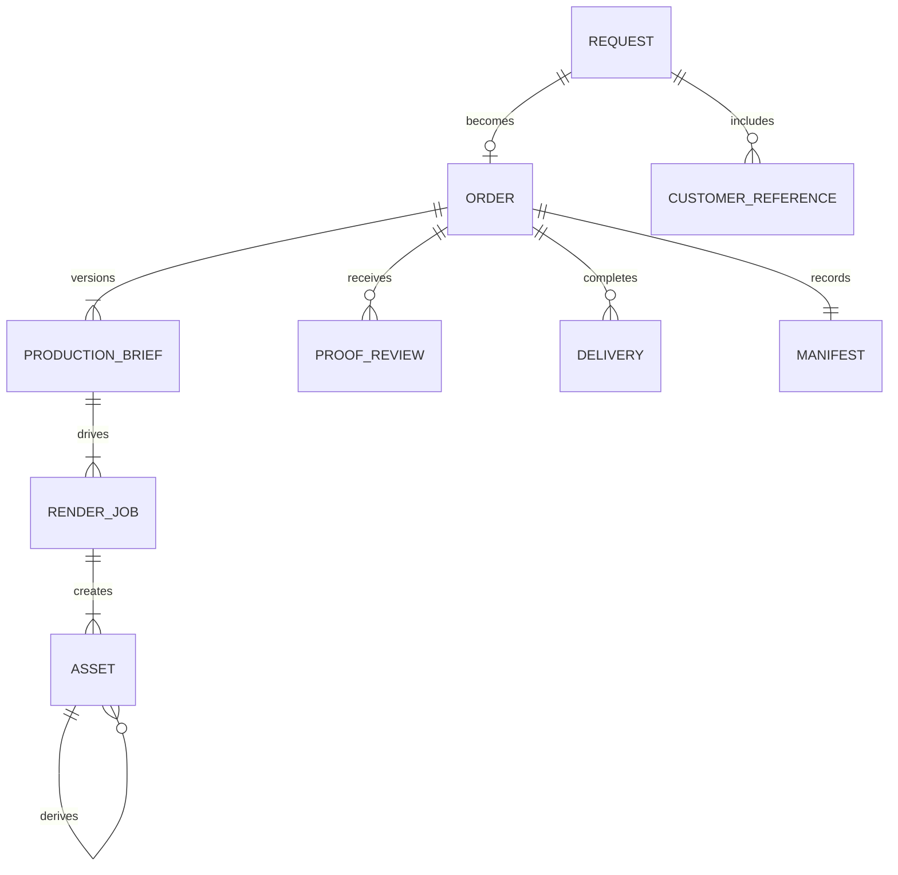

# Customer-to-Operations Experience Blueprint

**Status:** proposed experimental workflow — not production authorization  
**Date:** 2026-09-05  
**Scope:** a no-account, made-to-order experience for a sophisticated, affluent,
technology-novice, often one-time buyer; the internal operations model needed to
turn that request into a reproducible, rights-cleared deliverable.

## Intent

The product should not present itself as GIS software. A customer comes with a
place, a memory, a room, or a question. They should be able to understand the
four artifact types, choose one without learning technical vocabulary, see a
credible example of the result, submit an email-backed proposal, and receive a
clear proof and delivery. They do **not** need an account, a project dashboard,
or a persistent self-service editor.

The company still needs a rigorous internal workflow. Every requested and
produced image must be cataloged, traceable to a brief and render recipe, kept
separate from customer-supplied materials, and associated with a rights and
delivery record. The existing deterministic pipeline and `src.fulfillment`
model are the foundation; this blueprint adds the product and operations
surfaces around them.

This is a roadmap artifact for future agents. It distinguishes what exists,
what the current experiments demonstrate, and what needs implementation.

## Product boundary and commercial guardrails

- The current commercial validation path remains narrow: made-to-order county
  watershed prints in OR/WA/CA/ID, as stated in roadmap items 56–59.
- The four-product catalog is an **experiment and information architecture**.
  It must not be treated as authorization to launch self-serve catalog/POD,
  expand geography, or sell every product before the revenue gate passes.
- A sellable artifact must use allowed sources and include the deterministic
  source-credit line. nClimGrid-backed reports/animations may be sellable with
  attribution; PRISM-derived assets remain non-sellable unless rights change.
- An email address is an order-contact identifier, not an account. Do not add
  passwords, profiles, browsing history, or marketing consent by implication.
- “Forecast” must never mean a promised prediction. Until an approved forecast
  method exists, present the report as historical analysis plus “questions for
  future monitoring,” not as a forecast product.

## Lifecycle diagram

`workflow.mmd` is the canonical compact flowchart. The same process is shown
below for Markdown readers.

```mermaid
flowchart LR
    visitor([Prospective buyer]) --> splash[Public splash page]
    splash --> catalog[Artifact catalog]
    catalog --> choose[Product and place selection]
    choose --> proposal[Proposal cart]
    proposal --> proof[Expectation proof]
    proof --> submit[Email and request submitted]
    submit --> intake[Operations intake queue]
    intake --> valid{Scope and rights valid?}
    valid -->|No| clarify[Clarify or decline]
    clarify --> visitor
    valid -->|Yes| order[(Order record)]
    order --> brief[Production brief]
    brief --> recipe[Versioned render recipe]
    recipe --> job[Render and export job]
    job --> qa{Visual and provenance QA?}
    qa -->|Needs work| brief
    qa -->|Pass| asset[(Asset library)]
    asset --> proofSend[Proof email and review link]
    proofSend --> approve{Buyer approves?}
    approve -->|Revision| brief
    approve -->|Yes| deliver[Deliver files or send print to fulfillment]
    deliver --> archive[Archive manifest and outcomes]
    archive --> complete([Buyer owns a documented artifact])
```



### Beginning and end states

| Actor | Beginning state | End state | Success condition |
| --- | --- | --- | --- |
| Buyer | Has a meaningful place or question, but no knowledge of GIS, formats, or pipeline settings. | Has an emailed, documented image, animation, print, or report and knows what it represents. | The experience felt calm, personal, and trustworthy without requiring an account. |
| Operations | Has an email proposal with incomplete or unvalidated intent. | Has an archived, reproducible, rights-cleared asset record and a delivery outcome. | Any delivered artifact can be located, explained, regenerated, and audited. |
| System | Has public examples and generated source data. | Has linked request, brief, recipe, job, assets, proof, manifest, and delivery records. | No orphaned asset or untraceable customer request exists. |

## Customer workflow: first and possibly only visit

The customer path has one primary job at each moment. This avoids the current
“studio control surface” problem, where geographic and rendering choices arrive
before the person understands the outcome.

| Step | Customer question | Customer-facing UX | Required content and behavior | Exit state |
| --- | --- | --- | --- | --- |
| Discover | “What is this?” | **Splash / landing** | One sentence about turning a meaningful place into a finished artifact; one compelling, labeled example; no technical controls. | Understands the offer. |
| Orient | “What can I receive?” | **Artifact catalog** | Four clearly differentiated cards with example, use case, included delivery, starting price, lead time, and a plain-language limitation. | Chooses an artifact family. |
| Imagine | “Will this resemble something I want?” | **Product detail / expectation proof** | At least three examples at the same scope, titled “example of art to expect”; explain what varies by place and what will remain consistent. | Has calibrated expectations. |
| Personalize | “What place and feeling?” | **Guided brief** | Choose a location, a small curated art direction set, title/subtitle preference, and artifact-specific choices. Use progressive disclosure; no raw palette, HUC, gamma, or file-format jargon. | Has a complete customer brief. |
| Commit lightly | “What have I chosen?” | **Proposal cart** | A single aligned summary, price, likely delivery window, example thumbnail, and editable choices. Label it a proposal until payment policy exists. | Ready to submit. |
| Identify | “How will you contact me?” | **Email request** | Email, name, optional note, consent checkbox only if marketing is desired. Explain that the email confirms the request and sends the proof. No account. | Request is submitted. |
| Reassure | “What happens now?” | **Confirmation page and email** | Request ID, compact summary, one art example, expected next contact, and a reply-to address. | Buyer can leave confidently. |
| Approve | “Is this my piece?” | **Proof review link** | A large watermarked proof, production summary, source-credit line, and simple Approve / Request adjustment choices. Link is signed, expires, and works without login. | Approval or a scoped revision request. |
| Receive | “What did I receive and how is it documented?” | **Delivery email / download page** | Artifact download or fulfillment notice, size/format, title, date, attribution, license, and “keep this link” language. | Completed ownership. |

### Four artifact definitions

| Product | Customer promise | Initial catalog options | Initial price hypothesis | Operations deliverable | Important non-promise |
| --- | --- | --- | --- | --- | --- |
| Digital image | A high-resolution personal map image of a meaningful place. | Place, art direction, title, digital size. | From $38. | PNG/JPEG plus compact manifest. | Not an editable GIS source file by default. |
| Moving water study | A short, elegant view of seasonal or historical change. | Place, time framing, art direction, GIF/MP4 delivery. | From $64. | GIF/MP4, poster frame, manifest. | Not a live forecast or real-time monitor. |
| Fine-art print | An archival map print designed for a room and kept for years. | Place, art direction, size, title. | From $110. | Print-ready PDF/PNG, proof, print-facility handoff or shipment record. | Do not promise a physical shipment until print fulfillment is operational. |
| Water story report | A researched visual explanation of how a watershed has behaved over time. | Watershed/place, historical framing, optional question. | From $95. | HTML/PDF report, figure set, methods/provenance appendix. | Not a professional engineering or investment forecast. |

## UX surface inventory

The following names are proposed stable route/page concepts. “Experimental”
means build and test under `experiments/`; it does not imply production launch.

| Surface | Audience | State transition | Status / next experiment |
| --- | --- | --- | --- |
| `experiments/shop.html` | Buyer | Discover → artifact selection | Exists as a visual/interaction prototype; needs asset-specific detail and explicit request submission next. |
| Product detail / expectation proof | Buyer | Artifact selected → informed brief | **New experiment.** Needs controlled before/after examples, dimensions, lead time, and “what varies.” |
| Guided brief | Buyer | Informed brief → draft proposal | **New experiment.** Replace a general studio form with a 3–5 choice wizard per product. |
| Proposal cart | Buyer | Draft proposal → submitted request | Exists as pseudo-cart in `shop.html`; needs email form and request payload schema. |
| Confirmation page + email | Buyer | Submitted → waiting for proof | **New experiment.** No account; must include request ID and art expectation example. |
| Proof review | Buyer | Proof sent → approve / revision | **New experiment.** Signed public link with large proof and limited revision language. |
| Delivery page + email | Buyer | Approved → completed | **New experiment.** Requires delivery/fulfillment state but no account. |
| `web/studio.html` | Internal art director / expert | Brief → preview/recipe | Existing production-oriented control surface; **internal only** after this blueprint. It should not be the buyer’s first interface. |
| Operations intake queue | Operations | Submitted → validated | **New internal UX.** Triage request, validate scope/rights, create order. |
| Production workspace | Operations | Validated → proof candidate | **New internal UX.** Brief, recipe, source state, render jobs, QA, and proof comparison. |
| Asset library | Operations | Rendered → reusable/archived asset | **New internal UX.** Searchable catalog and lineage browser. |
| Fulfillment desk | Operations | Approved → delivered | **New internal UX.** Export checklist, email/send action, print handoff, and closeout. |
| Reporting workspace | Research / operations | Question → approved analytical report | Existing notebooks/tools are the analytic base; **new internal UX** is a report run/figure review shell, not a buyer editor. |

## Internal operations workflow

### Ownership and handoffs

| Phase | Owner | Internal-facing UX | Required checks | Output |
| --- | --- | --- | --- | --- |
| Intake | Operations coordinator | Intake queue | Contactability; product availability; geography; request completeness; duplicate detection. | `Request` record and triage status. |
| Scope and rights | Operations coordinator + data lead | Intake detail | Product rules; source eligibility; climate-source check; location support; commercial-rights flag. | Accepted request or plain-language clarification/decline email. |
| Briefing | Art director | Production workspace | Customer selections translated to a constrained style/size/time recipe; title rules; requested images classified. | Versioned `ProductionBrief`. |
| Render | Production artist / pipeline | Production workspace | Deterministic render job, tool version, source/data snapshot, output profile. | Candidate assets plus run log. |
| QA | Art director + data QA | QA review | Correct place/scope; visual legibility; title; source credit; dimensions; checksum; rights; no accidental customer data exposure. | Approved proof candidate or rework reason. |
| Buyer proof | Operations coordinator | Proof sender | Watermark; accessible proof link; expiry; accurate delivery window; revision limit. | Proof email event and buyer decision. |
| Fulfillment | Operations coordinator | Fulfillment desk | Approval captured; export checklist; license; manifest; print handoff/dispatch. | Delivery event. |
| Archive | Operations coordinator | Asset library | Manifest complete; asset relations; retention state; request images separated; revenue/outcome recorded. | Searchable archival record. |

### Internal-only UX rule

Never expose an internal-only field in customer UX: source paths, cache location,
HUC identifiers, raw QA failures, rights flags, customer email history, job logs,
checksums, pipeline arguments, or other customers’ assets. Customers receive a
clear prose description, selected title, source credit, and approved proof—not
the machinery behind it.

## Catalog and library scheme

### Separate the catalog from the library

- **Public catalog:** curated products and examples. It is a marketing and
  decision aid; only approved, rights-cleared examples appear here.
- **Request library:** buyer-submitted reference images and request attachments.
  Private, immutable originals; never reused as public examples without explicit
  written permission.
- **Production asset library:** every generated preview, proof, final, report
  figure, and delivery bundle. Searchable internally and tied to its lineage.
- **Data/provenance registry:** source snapshot and render-recipe records. It
  supports reproducibility but is not a customer media library.

### Identifiers

Use independently meaningful IDs. Do not make filenames the primary database.

| Entity | ID pattern | Purpose |
| --- | --- | --- |
| Request | `REQ-YYYYMMDD-####` | Email-submitted, pre-payment/proposal record. |
| Order | `ORD-YYYYMMDD-####` | Accepted paid/approved commission; maps to existing fulfillment `order_id`. |
| Brief revision | `BRF-<order>-rN` | Immutable interpretation of the customer request. |
| Render job | `JOB-<order>-rN` | One pipeline execution against a brief revision. |
| Asset | `AST-<order>-<role>-rN` | Preview, proof, final, report figure, delivery bundle, or thumbnail. |
| Delivery | `DLV-<order>-N` | A sent download, print handoff, or shipment event. |
| Customer reference | `REF-<request>-N` | A buyer-provided image/file; never assumed licensed for reuse. |

### Proposed storage layout

This is a layout contract, not an instruction to use a specific cloud vendor.
The record database should hold IDs/metadata; object storage holds immutable
files. Access URLs must be generated, not stored as permanent public paths.

```text
library/
  requests/REQ-YYYYMMDD-####/
    request.json
    references/REF-...-original.ext
    correspondence/intake-email.eml-or-json
  orders/ORD-YYYYMMDD-####/
    brief/BRF-...-r1.json
    recipes/recipe-r1.yaml
    jobs/JOB-...-r1/run-log.json
    proofs/AST-...-proof-r1.jpg
    finals/AST-...-final-r1.png
    reports/AST-...-report-r1.pdf
    manifests/ORD-....manifest.json
    delivery/DLV-...-record.json
```

### Required asset metadata

Every `Asset` needs the following fields before it can be sent or published:

```text
asset_id, order_id or request_id, role, status, created_at, created_by,
source_kind, original_filename, media_type, pixel_width, pixel_height,
checksum_sha256, brief_revision, recipe_digest, render_job_id,
rights_status, attribution_text, visibility, retention_class,
parent_asset_id, customer_reference_id, storage_key
```

Rules:

1. `source_kind` is one of `generated`, `customer_supplied`, `licensed`, or
   `reference_only`; it is never guessed from a filename.
2. `visibility` is one of `internal`, `customer_private`, `approved_public`,
   or `expired`. Default is `internal` for generated assets and
   `customer_private` for customer material.
3. A final asset must reference one approved brief revision, recipe digest,
   render job, attribution text, and checksum.
4. Derivatives retain a `parent_asset_id`; do not overwrite proof or final
   files in place.
5. A buyer reference may influence art direction, but does not become a
   training/public/gallery asset without explicit permission recorded separately.

## Core state model

### Customer request and production states



### Minimum records and relationships



## Email-first, no-account model

| Event | Message must contain | Link/control | Data retention note |
| --- | --- | --- | --- |
| Request received | Request ID, selected artifact/place, one expectation example, next-step timing, reply email. | Optional view-only request summary link. | Email is used only for fulfillment unless marketing consent is explicit. |
| Clarification | One plain question and why it matters. | Reply by email or signed update link. | Do not force account creation. |
| Proof ready | Large proof image, title, location, source credit, approval deadline, adjustment policy. | Signed Approve / Request adjustment link. | Proof is private and watermarked. |
| Approved / in production | Confirmed approved selection and delivery estimate. | View-only summary. | Keep immutable approval event. |
| Delivered | Download/fulfillment details, format/size, attribution, license, and manifest summary. | Time-limited signed download; reissue via email support. | Delivery logs are internal. |

## Experiment sequence

Build experiments in this order; each validates a customer or operations
assumption before a production system is created.

1. **Catalog comprehension:** Iterate `experiments/shop.html` with affluent,
   low-technology-comfort participants. Test whether they can distinguish all
   four artifacts, estimate an expected price, and choose one without help.
2. **Expectation proof:** Build one product-detail page for the fine-art print.
   Test whether a buyer can state what will vary by location, what file/print
   they receive, and what “from” pricing means.
3. **Guided brief:** Build an art-direction wizard with 3–5 decisions. Test
   completion time, need for help, and whether choices make a useful brief.
4. **Proposal + email confirmation:** Prototype the request submission and two
   emails. Test trust, clarity of next steps, and willingness to submit email.
5. **Internal intake queue:** Prototype the coordinator view from a submitted
   request. Test whether an operator can validate and make a brief without
   copying data between systems.
6. **Production workspace + asset library:** Prototype one order through job,
   proof, approval, final, manifest, and search. Test lineage recovery from an
   asset alone.
7. **Proof and delivery:** Prototype a no-login proof link and delivery email.
   Test whether customer can approve and find the core source/size information.

## Roadmap slices

These are proposed work packages, not a revision of the commercial gate.

| Slice | Outcome | Dependencies | Effort |
| --- | --- | --- | --- |
| E1: Customer information architecture | Stable catalog, product vocabulary, expectation proof, and guided-brief experiments. | Existing optimized examples and shop prototype. | M |
| E2: Request boundary | Request schema, email capture/confirmation prototype, constraint validation, and request IDs. | E1; no payment integration. | M |
| E3: Operations intake and brief | Internal queue, request triage, immutable brief revisions, mapping to `src.fulfillment.Order`. | E2 and existing fulfillment validation. | L |
| E4: Asset catalog and provenance | Object-store adapter, asset metadata, lineage, checksums, retention/visibility, internal library UX. | E3 and existing manifest tooling. | XL |
| E5: Proof/revision/delivery | Signed proof/review links, revision state transitions, delivery receipts, export/print handoff UX. | E3–E4. | L |
| E6: Product-by-product launch decision | Add digital, animation, or report surface only after each has a validated delivery, rights, and buyer-understanding path. | Revenue gate and relevant pipeline capability. | M each |

## Acceptance criteria for a first operational pilot

The pilot is ready only when one staff member can execute this without a
spreadsheet-only handoff or an untracked file:

1. A buyer submits a no-account request and receives a confirmation email with
   request ID and an expectation example.
2. Operations can accept, clarify, or decline the request using explicit
   geography and rights checks.
3. An accepted request becomes one immutable production brief and a valid
   existing `Order` payload.
4. A generated proof can be traced from the visible file to its brief, recipe,
   render job, sources/attribution, and checksum.
5. A customer can approve or request one adjustment without an account.
6. A final delivery carries attribution and a manifest; asset status moves to
   `customer_private`/`approved_public` only through an explicit decision.
7. Operations can locate every requested image, proof, final, and delivery from
   a request ID, order ID, or asset ID.

## Open decisions before production implementation

1. What is the initial sales channel: direct site request, Etsy-style listing,
   or a concierge email intake? This changes where payment and platform messages
   live, not the internal record model.
2. Is a proposal non-binding or does it become an order after manual payment?
   Define this before enabling “submit” language.
3. What revision policy is included per artifact, and who may approve exceptions?
4. What print partner, shipping geography, and proof-to-production cutoff apply?
5. Which data sources and method language are approved for the report product,
   including any future forecast framing?
6. Which asset-retention period and deletion process apply to customer reference
   images and private proofs?
7. Who is allowed to change public catalog examples and mark an asset
   `approved_public`?

## Non-goals

- Customer accounts, passwords, subscriptions, or a buyer-facing GIS editor.
- Automatic payment, tax, shipping-rate, POD, or marketplace integration.
- Autonomous production without an operations QA/proof gate.
- Reusing customer-provided images in public marketing without explicit rights.
- Representing historical climate analysis as a forecast.
